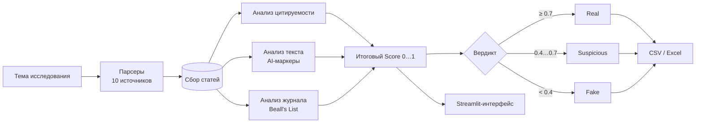

# 🔬 Science Paper Analyzer

Система для парсинга и верификации научных статей из 10+ источников с определением фейковых и недостоверных публикаций.

**Тема диссертации:** Разработка методов фильтрации генеративных текстовых данных для предотвращения коллапса языковых моделей.

[](https://www.python.org/)
[](https://streamlit.io/)
[](LICENSE)
[](https://colab.research.google.com/github/DmitPerson42/science-paper-analyzer/blob/main/science_paper_analyzer.ipynb)

---

## Как это устроено



Координатор — `analyzer.py`: он собирает статьи, прогоняет три анализатора,
сводит их в один балл и отдаёт результат в таблицу. Парсеры и анализаторы
независимы: новый источник добавляется файлом в `parsers/`, новый критерий —
файлом в `analyzers/`.

---

## 🚀 Быстрый старт

### Вариант 1 — Google Colab (рекомендуется)

1. Откройте [`science_paper_analyzer.ipynb`](science_paper_analyzer.ipynb) в Google Colab
2. Запустите ячейки по порядку
3. Введите тему поиска и получите результаты

### Вариант 2 — веб-интерфейс локально

```bash
git clone https://github.com/DmitPerson42/science-paper-analyzer.git
cd science-paper-analyzer
pip install -r requirements.txt
streamlit run app.py
```

Интерфейс откроется на <http://localhost:8501>: ввод темы, выбор источников,
цветовая индикация результатов, детальный разбор каждой статьи и экспорт.

### Вариант 3 — как библиотека

```python
from analyzer import PaperAnalyzer

analyzer = PaperAnalyzer()
papers = analyzer.collect_papers("retrieval augmented generation", max_per_source=5)
df = analyzer.analyze_papers(papers)      # DataFrame с итоговым Score

analyzer.export_csv(df, "results.csv")
analyzer.export_excel(df, "results.xlsx")
```

`collect_papers` обходит включённые источники и возвращает список словарей,
`analyze_papers` возвращает `pandas.DataFrame` — по строке на статью.

---

## 📡 Источники данных

| Источник | Метод | Статус |
|----------|-------|--------|
| [arXiv.org](https://arxiv.org) | REST API | ✅ |
| [Semantic Scholar](https://semanticscholar.org) | REST API | ✅ |
| [OpenReview.net](https://openreview.net) | REST API | ✅ |
| [ACL Anthology](https://aclanthology.org) | REST API | ✅ |
| [JMLR.org](https://jmlr.org) | Scraping | ✅ |
| [ResearchGate](https://researchgate.net) | CrossRef API | ✅ |
| [CyberLeninka.ru](https://cyberleninka.ru) | Scraping | ✅ |
| [eLibrary.ru](https://elibrary.ru) | CrossRef API | ✅ |
| [Dissercat.com](https://dissercat.com) | CrossRef API | ✅ |
| [FIPS.ru](https://fips.ru) | CrossRef API | ✅ |

Универсальный путь — `parsers/crossref_fallback.py`: если конкретный источник
не ответил или у него нет API, запрос уходит через CrossRef по названию или DOI.

---

## 🔍 Критерии оценки

Статья получает **Score** от 0.0 (фейк) до 1.0 (достоверная) по трём параметрам:

### 1. 📊 Цитируемость (Citation Score)
- **0 цит.** + возраст ≥3 лет → низкое доверие (0.2)
- **0 цит.** + молодая статья → нейтрально (0.5)
- **1–5 цит.** → нормально (0.7)
- **5–15 цит.** → хорошо (0.85)
- **>15 цит.** → высокое доверие (0.95)

### 2. 📝 Текст (Text Score)
Эвристический анализ на признаки AI-генерации:
- поиск AI-маркерных фраз;
- лексическое разнообразие (TTR);
- повторяющиеся n-граммы;
- равномерность длины предложений;
- доля стоп-слов.

### 3. 🏛️ Журнал (Journal Score)
- проверка по **Beall's List** (>200 хищнических журналов);
- проверка по списку доверенных площадок (Nature, Science, IEEE, ACL, arXiv и др.);
- если журнал не найден ни в одном списке — нейтральная оценка.

### Итоговый вердикт

| Score | Вердикт |
|-------|---------|
| ≥0.7 | ✅ **Real** |
| 0.4–0.7 | ⚠️ **Suspicious** |
| <0.4 | ❌ **Fake** |

---

## ⚠️ Границы применимости

Score — эвристика, а не доказательство. Что стоит учитывать при интерпретации:

- **свежая статья без цитит не подозрительна** — поэтому у молодых работ
  нейтральная оценка, а не низкая;
- **журнал вне списков не значит плохой** — отсутствие в Beall's List и в списке
  доверенных площадок даёт нейтральную оценку, а не штраф;
- **текстовый анализ ловит статистические следы генерации**, но не доказывает
  авторство: отредактированный человеком текст даёт смещённые TTR и n-граммы;
- **Scraping-источники (JMLR, CyberLeninka)** чувствительны к изменениям вёрстки
  — при сбое срабатывает запасной путь через CrossRef.

---

## 📁 Структура проекта

```
science-paper-analyzer/
├── app.py                    # Streamlit веб-приложение
├── analyzer.py               # Центральный координатор
├── requirements.txt          # Зависимости
├── README.md                 # Эта инструкция
├── science_paper_analyzer.ipynb  # Google Colab ноутбук
├── tutorial.ipynb            # Построчное объяснение кода
├── parsers/
│   ├── arxiv_parser.py       # Парсер arXiv
│   ├── semantic_scholar.py   # Парсер Semantic Scholar
│   ├── openreview_parser.py  # Парсер OpenReview
│   ├── aclanthology.py       # Парсер ACL Anthology
│   ├── jmlr_parser.py        # Парсер JMLR
│   ├── crossref_fallback.py  # Универсальный парсер (CrossRef)
│   └── cyberleninka.py       # Парсер CyberLeninka
├── analyzers/
│   ├── citation_analyzer.py  # Анализ цитируемости
│   ├── text_analyzer.py      # Анализ текста (AI-детектор)
│   └── journal_analyzer.py   # Анализ журнала (Beall's List)
├── exporters/
│   ├── csv_exporter.py       # Экспорт в CSV
│   └── excel_exporter.py     # Экспорт в Excel
└── data/                     # Директория для результатов
```

---

## 📖 Документация

- [`tutorial.ipynb`](tutorial.ipynb) — построчное объяснение каждой строки каждого файла;
  открывается и в Colab, и в Jupyter.
- [`science_paper_analyzer.ipynb`](science_paper_analyzer.ipynb) — рабочий ноутбук
  для запуска без локальной установки.

---

## 📄 Лицензия

MIT — см. [LICENSE](LICENSE). Данные предоставляются «как есть». Beall's List
встроен в код программы.
